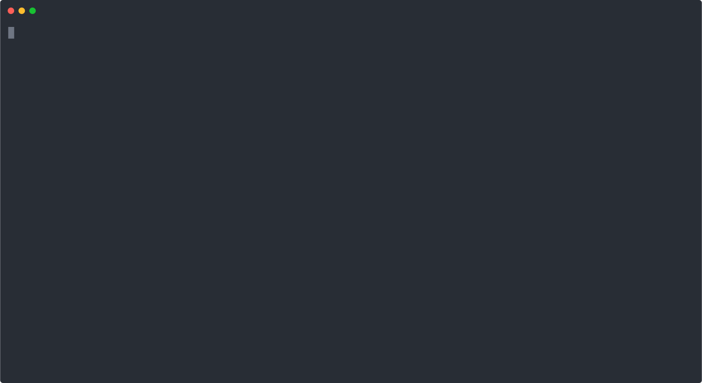

### Vryno Public API

---

Vryno public api is websocket/graphql based API. 

We have also developed a javascript client which can also provide a traditional request/response api.

Which is essentially a javascript wrapper on top of the websocket api. In our [web application](https://app.vryno.dev) we are using this javascript client.

#### Environments

---

We support following environments:

stage : vryno.dev

prod : vryno.com

This documentation is written with stage environment, as an example. Just replace `dev` domain with `com` domain to access the production environment.

#### Basics

---

Every request to the vryno api would need a guid/uuid for each request, and every websocket connection would need a client id uuid/guid for each connection to be established.

Vryno client(javascript package) abstracts all this information and exposes a `fetch` kind of interface for communicating to the backend. 

Following is demonstration of the public api. Using npm package wscat https://www.npmjs.com/package/wscat

All the sample requests can be found here inside the [requests folder](https://github.com/vryno/api-docs/tree/gh-pages/requests)

#### Basic Echo test

---

Ascii recording of above demo can be found here as well [Basic Authentication](https://asciinema.org/a/482550)

#### Authentication

---
As of now signup and login requires google captcha token, plan is to implement an oauth flow, so that user can login without the captcha.
So, first [signup](https://app.vryno.dev/signup) then [login](https://app.vryno.dev/login) a cookie will be set with the name `vryno-access-token` that is required for any further api interaction. One can always download the cookie and have a look at the token.

